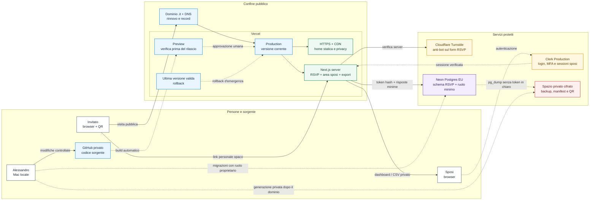

# Disegno architetturale operativo

Questo disegno descrive l'architettura prevista per la pubblicazione di SITE LOVE.
Rappresenta i confini di sicurezza, i flussi degli invitati e degli sposi, il
rilascio da GitHub e il percorso separato dei backup. Non contiene credenziali,
dati reali degli invitati o nomi di risorse ancora da creare.

## Come leggere le frecce

- Le frecce continue sono traffico del sito o dati dell'applicazione.
- Le frecce tratteggiate sono autenticazione, pubblicazione o operazioni manuali.
- La home pubblica non interroga il database: Neon viene usato soltanto dalle
  route RSVP e amministrative.
- Clerk non protegge gli invitati: protegge esclusivamente l'area degli sposi.
- Il link personale passa al server, ma nel database viene conservato soltanto
  il suo hash SHA-256.
- Backup, manifest e QR restano fuori da GitHub, Vercel e dalla cartella
  pubblica del sito.

## Ambienti e ritorno alla versione valida

Il flusso normale è `GitHub → Preview → Production`. Prima di promuovere una
modifica si controllano build, form e area sposi nella Preview. Se il sito si
rompe dopo un rilascio, Vercel Hobby permette di tornare alla precedente
versione di produzione; il database non viene automaticamente riportato
indietro insieme al codice e va gestito separatamente.

La procedura completa è in `docs/operations-guide.md`.
